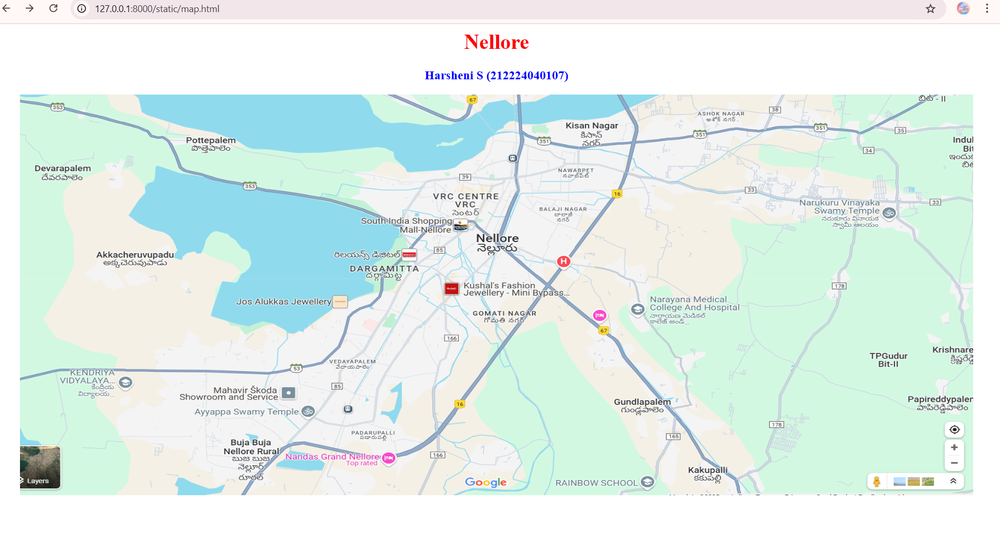
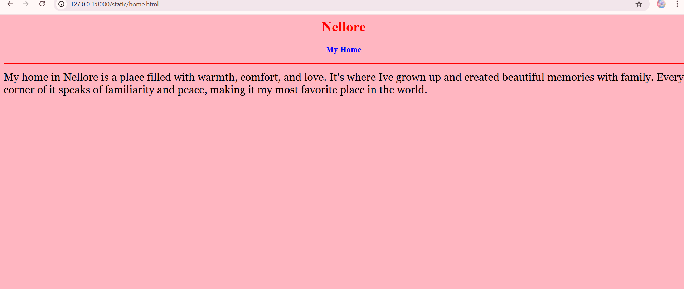
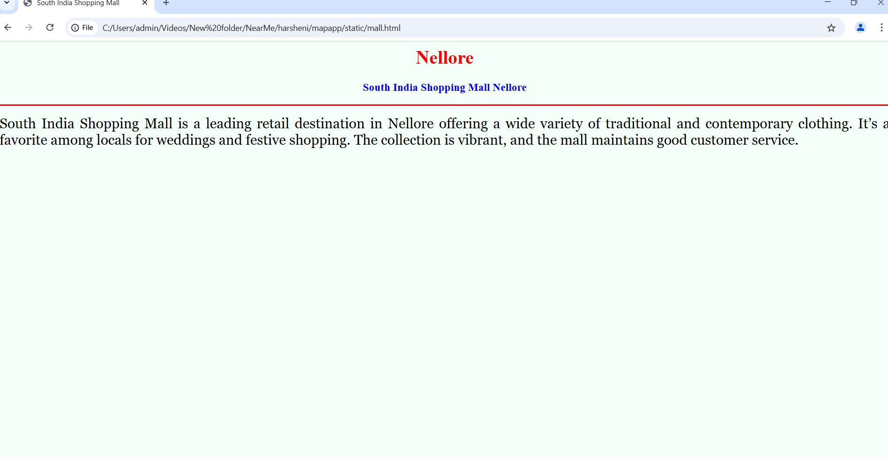
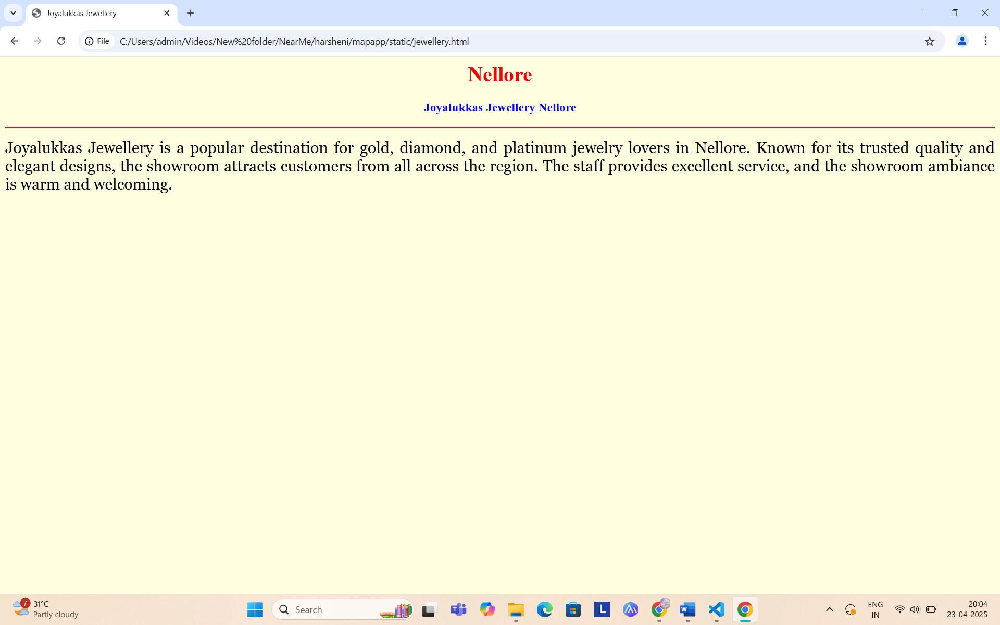
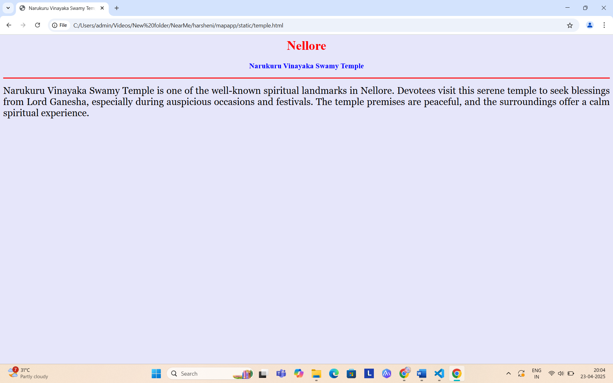
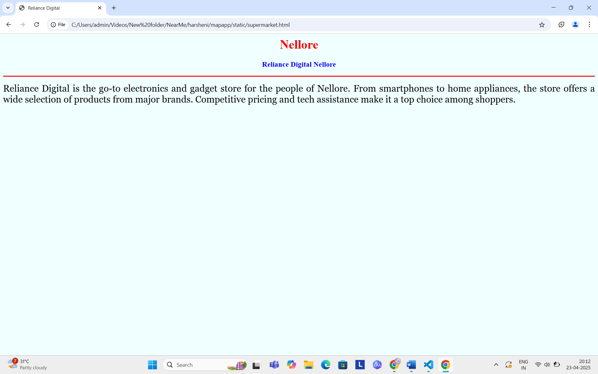

# Ex04 Places Around Me
## Date: 24.04.2025

## AIM
To develop a website to display details about the places around my house.

## DESIGN STEPS

### STEP 1
Create a Django admin interface.

### STEP 2
Download your city map from Google.

### STEP 3
Using ```<map>``` tag name the map.

### STEP 4
Create clickable regions in the image using ```<area>``` tag.

### STEP 5
Write HTML programs for all the regions identified.

### STEP 6
Execute the programs and publish them.

## CODE
```
map.html

<html>
<head>
<title>My City</title>
</head>
<body>
<h1 align="center">
<font color="red"><b>Nellore</b></font>
</h1>
<h3 align="center">
<font color="blue"><b>Harsheni S (212224040107)</b></font>
</h3>
<center>

<map name="MyCity">
<area shape="rect" coords="600,10,900,900" href="home.html" title="My Home Town">
<area shape="circle" coords="720,400,20" href="jewellery.html" title="Joyalukkas Jewellery Nellore">
<area shape="circle" coords="1170,230,20" href="temple.html" title="Narukuru Vinayaka Swamy Temple">
<area shape="circle" coords="620,290,20" href="mall.html" title="South India Shopping Mall Nellore">
<area shape="circle" coords="640,320,20" href="supermarket.html" title="Reliance Digital Nellore">
</map>
</center>
</body>
</html>
```
```
home.html

<html>
<head>
<title>My Home</title>
</head>
<body bgcolor="lightpink">
<h1 align="center">
<font color="red"><b>Nellore</b></font>
</h1>
<h3 align="center">
<font color="blue"><b>My Home</b></font>
</h3>
<hr size="3" color="red">
<p align="justify">
<font face="Georgia" size="5">
My home in Nellore is a place filled with warmth, comfort, and love. It's where Ive grown up and created beautiful memories with family. Every corner of it speaks of familiarity and peace, making it my most favorite place in the world.
</font>
</p>
</body>
</html>
```
```
mall.html

<html>
<head>
<title>South India Shopping Mall</title>
</head>
<body bgcolor="mintcream">
<h1 align="center">
<font color="red"><b>Nellore</b></font>
</h1>
<h3 align="center">
<font color="blue"><b>South India Shopping Mall Nellore</b></font>
</h3>
<hr size="3" color="red">
<p align="justify">
<font face="Georgia" size="5">
South India Shopping Mall is a leading retail destination in Nellore offering a wide variety of traditional and contemporary clothing. It’s a favorite among locals for weddings and festive shopping. The collection is vibrant, and the mall maintains good customer service.
</font>
</p>
</body>
</html>


```
```
jewellery.html

<html>
<head>
<title>Joyalukkas Jewellery</title>
</head>
<body bgcolor="lightyellow">
<h1 align="center">
<font color="red"><b>Nellore</b></font>
</h1>
<h3 align="center">
<font color="blue"><b>Joyalukkas Jewellery Nellore</b></font>
</h3>
<hr size="3" color="red">
<p align="justify">
<font face="Georgia" size="5">
Joyalukkas Jewellery is a popular destination for gold, diamond, and platinum jewelry lovers in Nellore. Known for its trusted quality and elegant designs, the showroom attracts customers from all across the region. The staff provides excellent service, and the showroom ambiance is warm and welcoming.
</font>
</p>
</body>
</html>
```
```
temple.html
<html>
<head>
<title>Narukuru Vinayaka Swamy Temple</title>
</head>
<body bgcolor="lavender">
<h1 align="center">
<font color="red"><b>Nellore</b></font>
</h1>
<h3 align="center">
<font color="blue"><b>Narukuru Vinayaka Swamy Temple</b></font>
</h3>
<hr size="3" color="red">
<p align="justify">
<font face="Georgia" size="5">
Narukuru Vinayaka Swamy Temple is one of the well-known spiritual landmarks in Nellore. Devotees visit this serene temple to seek blessings from Lord Ganesha, especially during auspicious occasions and festivals. The temple premises are peaceful, and the surroundings offer a calm spiritual experience.
</font>
</p>
</body>
</html>
```
```
supermarket.html

<html>
<head>
<title>Reliance Digital</title>
</head>
<body bgcolor="azure">
<h1 align="center">
<font color="red"><b>Nellore</b></font>
</h1>
<h3 align="center">
<font color="blue"><b>Reliance Digital Nellore</b></font>
</h3>
<hr size="3" color="red">
<p align="justify">
<font face="Georgia" size="5">
Reliance Digital is the go-to electronics and gadget store for the people of Nellore. From smartphones to home appliances, the store offers a wide selection of products from major brands. Competitive pricing and tech assistance make it a top choice among shoppers.
</font>
</p>
</body>
</html>

```


## OUTPUT














## RESULT
The program for implementing image maps using HTML is executed successfully.
